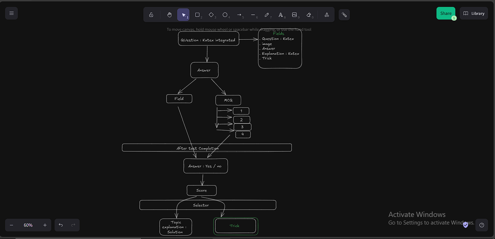

# testsat

**testsat** is an online digital test platform.

## Tech Stack

- React
- Node.js
- Express
- MongoDB

## Setup Checklist

- [✔] Set up new React and Node.js projects  
- [✔] Install required dependencies  
- [✔] Create a basic Express server  
- [✔] Auth template setup
- [✔] Establish database connection  
- [ ] Define Student and Admin models  
- [ ] Implement CRUD routes  
- [ ] Add authentication  
- [ ] Configure protected routes  
- [ ] Build test creation and editing (Admin)  
- [ ] Build test-taking functionality (Student)  
- [ ] Implement score retrieval (Student)  
